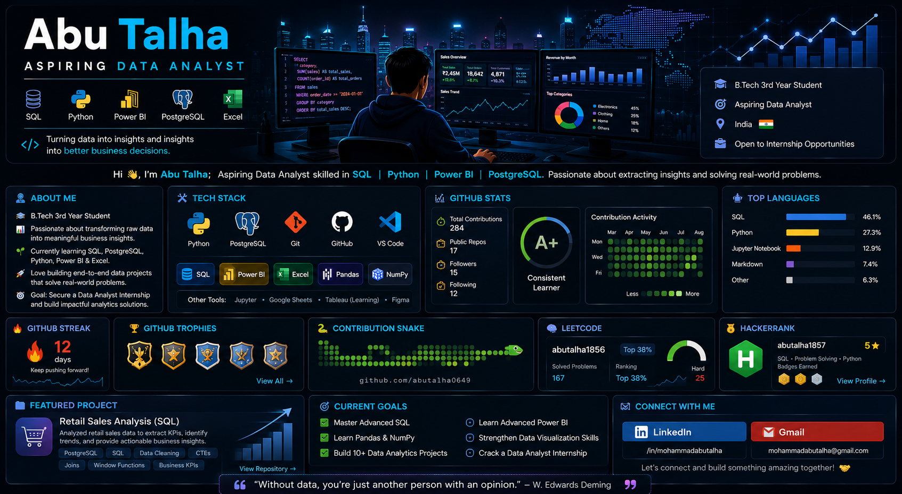

<!-- ========================================================= -->
<!--                        HERO BANNER                         -->
<!-- ========================================================= -->

<p align="center">
  
</p>

<h1 align="center">Hi 👋, I'm Abu Talha</h1>

<h3 align="center">
Aspiring Data Analyst • SQL • Python • Power BI • PostgreSQL
</h3>

<p align="center">

</p>

<p align="center">

<a href="#-about-me">About</a> •
<a href="#-tech-stack">Tech Stack</a> •
<a href="#-featured-projects">Projects</a> •
<a href="#-learning-dashboard">Learning</a> •
<a href="#-connect-with-me">Connect</a>

</p>

---

# 👨‍💻 About Me

<table>

<tr>

<td width="60%">

🎓 **B.Tech 3rd Year Student**

📊 **Aspiring Data Analyst**

📍 **India**

💡 Passionate about solving business problems using data.

🎯 **Career Goal**

Become a Data Analyst by building practical projects with SQL, Python, Power BI, and Excel.

</td>

<td align="center">

### 🚀 Current Focus

✔ SQL

✔ PostgreSQL

🔄 Python

🔄 Power BI

🔄 Excel Dashboard

</td>

</tr>

</table>

---

# 💻 Tech Stack

<p align="center">


</p>

<p align="center">


</p>

---

# 📊 Learning Dashboard

```text
SQL              ███████████████░░░ 85%

PostgreSQL       █████████████░░░░░ 75%

Python           █████████░░░░░░░░░ 55%

Power BI         ██████░░░░░░░░░░░░ 40%

Excel            ███████░░░░░░░░░░░ 45%
```

---

# 🚀 Featured Projects

## 🛍️ Retail Sales Analysis

> **Business Intelligence Project using PostgreSQL**

### 📌 Project Highlights

- 📊 Sales Trend Analysis
- 🧹 Data Cleaning
- 👥 Customer Analysis
- 💰 Revenue KPIs
- 📅 Time-based Analysis
- ⚡ SQL Joins
- ⚡ Window Functions
- ⚡ Common Table Expressions (CTEs)

### 🛠 Tools Used

`SQL` • `PostgreSQL`

### 🔗 Repository

**➡️ https://github.com/abutalha0649/Retail-Sales-Analysis-SQL-Project--P1**

---

## 📊 Upcoming Projects

| Project | Status |
|----------|--------|
| 📈 Power BI Sales Dashboard | 🚧 In Progress |
| 🐍 Python Data Analysis | 🚧 Coming Soon |
| 📉 Customer Churn Analysis | 📅 Planned |
| 📋 Excel Dashboard | 📅 Planned |

---

# 🏆 Achievements

🏅 **HackerRank SQL – 3★**

📘 Solving SQL Problems Regularly

📂 Building Data Analytics Portfolio

🎯 Preparing for Data Analyst Interviews

---

# 🗺️ 2026 Roadmap

```text
✔ SQL Fundamentals

✔ PostgreSQL

🔄 Python

🔄 Power BI

⬜ Excel Dashboard

⬜ Machine Learning Basics

🎯 Data Analyst Internship
```

---

# 📚 Currently Exploring

- SQL Optimization
- Data Cleaning
- Exploratory Data Analysis (EDA)
- Power BI Dashboards
- Python (Pandas & NumPy)

---

# 🌐 Coding Profiles

<p align="center">

<a href="https://www.hackerrank.com/abutalha1857">

</a>

<a href="https://leetcode.com/u/abutalha1856/">

</a>

</p>

---

# 🤝 Connect With Me

<p align="center">

<a href="https://github.com/abutalha0649">

</a>

<a href="https://www.linkedin.com/in/mohammadabutalha">

</a>

<a href="mailto:YOUR_EMAIL@gmail.com">

</a>

</p>

---

<div align="center">

## 💬 Quote

> **"Data tells a story. I enjoy discovering it and turning it into decisions."**

⭐ **Thank you for visiting my profile!**

If you like my projects, feel free to ⭐ star the repositories and connect with me.

</div>
